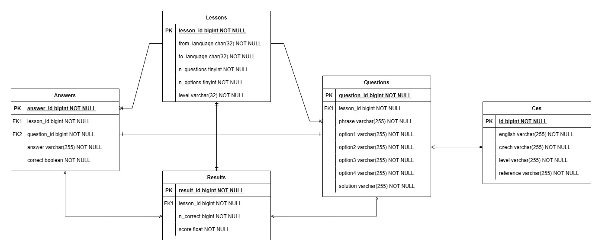

# Czech Tutor

## Overview

A simple single page website for practising Czech phrases and vocabulary.

## Data Model

Czech to English phrases and vocabulary sourced from:

* https://www.manythings.org/anki/
* https://apps.ankiweb.net/
* https://tatoeba.org/en

The underlying data model present used in CzechTutor is displayed below. 



For a more detailed account of each column in the dataset see the data dictionary:

* TODO

## Execute Web App

```
exeSpring.cmd
```

## Data Model

```
select * from lessons as l inner join results as r on l.lesson_id = r.lesson_id;
select * from questions as q inner join answers as a on q.question_id = a.question_id;
```