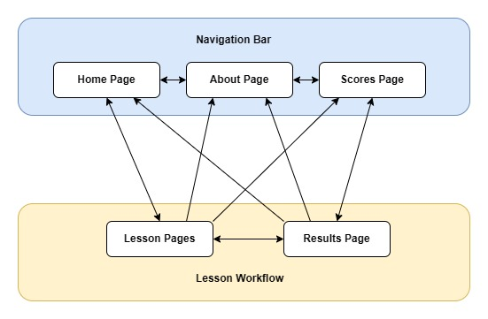
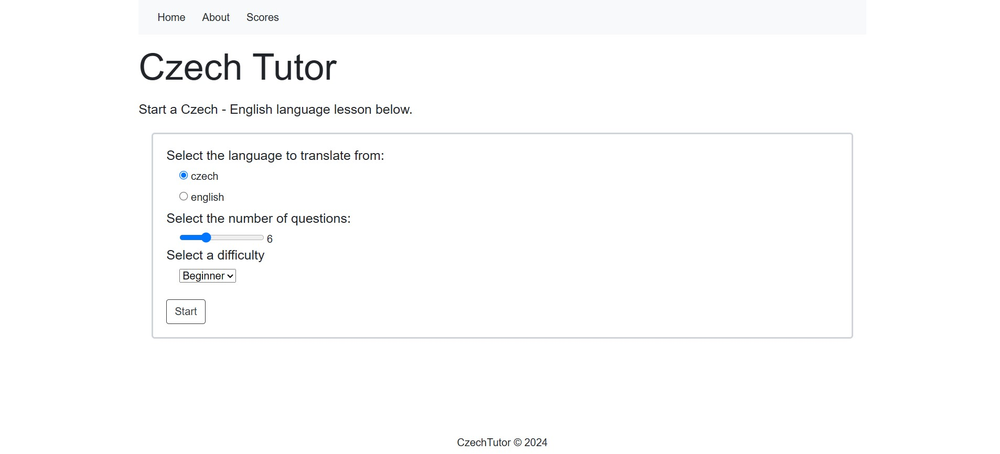
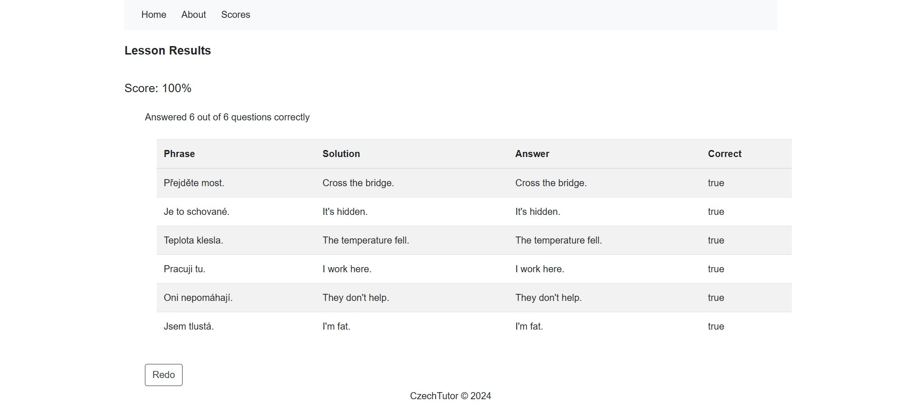

# Czech Tutor

## Overview

A simple web app for practising Czech - English phrase translation. 
Practice quizzes can be configured at various difficulty levels and lengths, and with phrase translation from either language.
Questions are randomly generated using the anki manythings ces dataset with respect to the lesson / quiz configurations.
The user answers for each question in a practice quiz are stored locally in an in-memory H2 database.
A final quiz score is calculate at the end of each practice quiz, and a lesson summary showing the question, answers and solutions is displayed.

## Web App Workflow

The web app workflow functions as below:



1. Users configure a practice quiz on the home page. 



2. They then iteratively answer each question in the quiz via the lesson page.


3. The user results are displayed at the end of the quiz on the results page.



## Data Model

Czech to English phrases and vocabulary sourced from:

* https://www.manythings.org/anki/
* https://apps.ankiweb.net/
* https://tatoeba.org/en

The underlying data model present used in CzechTutor is displayed below. 


For a more detailed account of each column in the dataset see the data dictionary:

* https://github.com/oislen/CzechTutor/blob/main/doc/data_dictionary.xlsx


## Running the Application

### Docker Image

The latests web app docker image can be found on dockerhub here:

* https://hub.docker.com/repository/docker/oislen/czechtutor/general

The image can be pull from docker hub using the following command:

```
docker pull oislen/czechtutor:latest
```

The web app docker image can then be executed using the following command:

```
docker run --name ct --publish 8080:8080 --rm oislen/czechtutor:latest
```

Once the web app is running, navigate to localhost:8080 in your prefered browser

* http://localhost:8080/home
